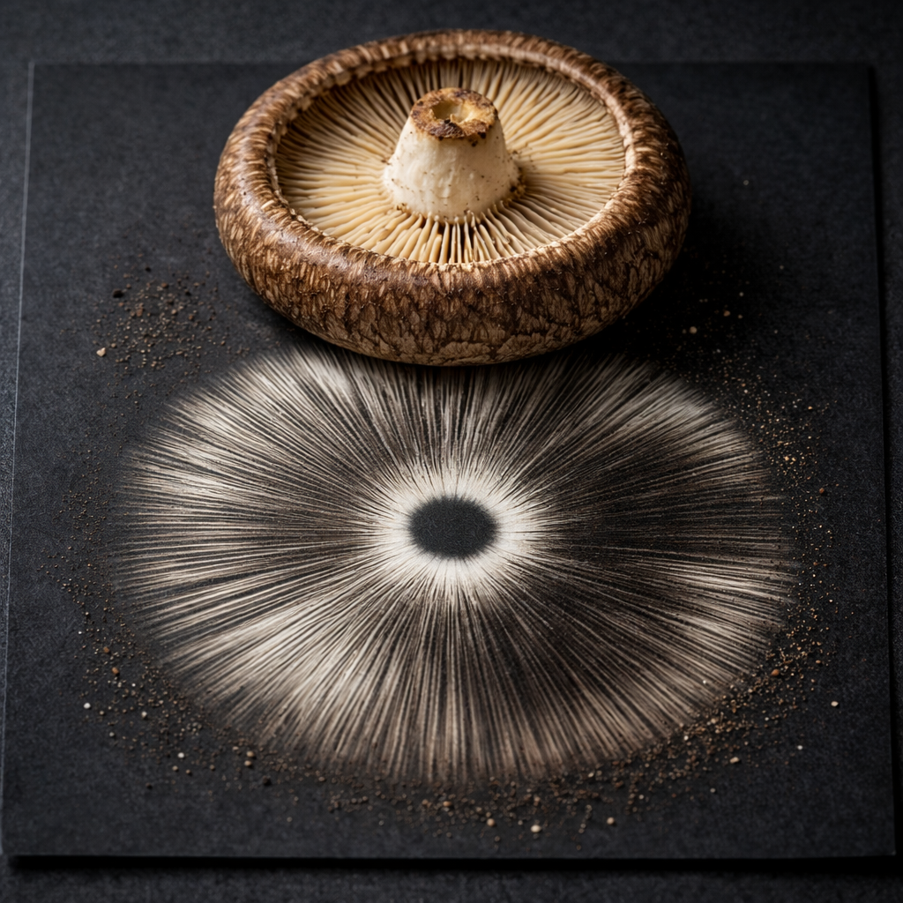

# Sporeprint

> * an audio fingerprinting cli tool and cgo library binding Chromaprint
> * [the powdery deposit obtained by allowing spores of a fungal fruit body to fall onto a surface underneath](https://en.wikipedia.org/wiki/Spore_print)




## Purpose

fpcalc (the Chromaprint default command line tools) heavily relies on ffmpeg, and Chromaprint itself
offers multiple different FFT backends with a variety of licenses.

While this is fine for users, the [licensing situation](https://github.com/acoustid/chromaprint/blob/master/LICENSE.md)
with it is complex if you intend on reusing and distributing.

Further, fpcalc itself is in C++, and dynamically links to ffmpeg libs.

Sporeprint (Apache license) addresses the first problem by linking solely against [Chromaprint](https://github.com/acoustid/chromaprint) (MIT),
compiled only with [KissFFT](https://github.com/mborgerding/kissfft) (BSD-3), and offers go bindings for Chromaprint, making it
possible to integrate as a library without having to shell out.

TL;DR sporeprint is "fpcalc-light" for the go world, without license minefield or dynamic linkage fuckery.

## Trade-offs

### Sporeprint does not convert the audio data on its own...

Sporeprint expects PCM. And see below...

### ... it must be little-endian 16 bits 11025/mono

Chromaprint internally performs fingerprinting on 11025/mono, and _claims_ to accept different rates (and stereo)
as input, apparently using a homegrown resampler (?) to convert to its desired format.

However, this resampler appears to be buggy, and definitely breaks on certain inputs (or over a certain number of seconds).
Or at least yields different results than ffmpeg.

This problem is presumably hidden because fpcalc itself does resample to the final desired format (using ffmpeg)
_before_ calling Chromaprint methods. The bottom-line is still: it seems you cannot reliably use Chromaprint without
taking care of the downsampling yourself (which fpcalc does).

Finally, fpcalc itself is adding some extra filtering into the mix (cutoff 0.8).

To obtain the same fingerprints with sporeprint, you thus need the following ffmpeg invocation:

```bash
ffmpeg -i track.flac -af "aresample=resampler=swr:filter_size=16:phase_shift=8:cutoff=0.8:linear_interp=1" -f s16le -ac 1 -ar 11025 pipe:1 2>/dev/null | sporeprint
```

fpcalc will yield the same results (but see below):
```bash
# Or
fpalc track.flac
```

So, why mono and 11025?

Presumably Chromaprint authors figured this was the sweet spot for accuracy vs. speed, which certainly makes sense.

## Build

```bash
# Dependencies (Debian/Ubuntu)
sudo apt install cmake build-essential
```

Then
```
make build
```

## Develop

```bash
make lint
make fix
make test
```

## Using in Go

Obviously you need to accept CGO.

See `cmd/sporeprint/main.go` for a working example.

Or just shell out to the provided binary.

## More

* [COMPAT](docs/COMPAT.md)
* [LANDSCAPE](docs/LANDSCAPE.md).
